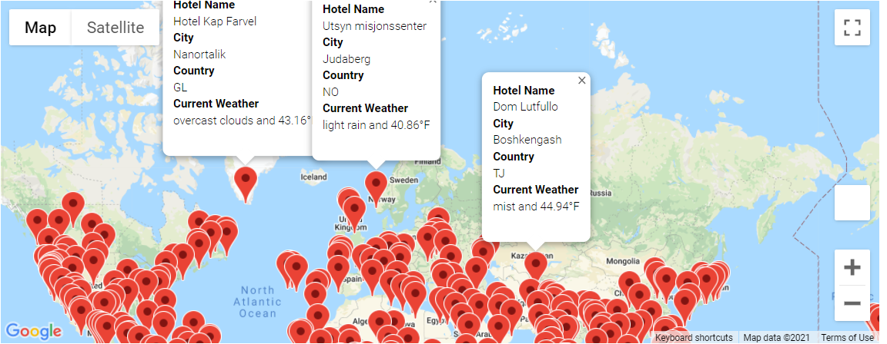

# World_Weather_Analysis
Module 6 Challenge

## Overview of Project

Due to the overwhelming success of the PlanMyTrip app, we have received terrific positive feedback along with some constructive criticsm on how to make the app even better.  Some of the feedback received includes adding the current weather status to the weather data retrieval.  This will be displayed once the users select their destinations preferences based on their weather preferences.  Once the traveler has the list of destinations that meet their weather criteria they will be able to specify which destinations and nearby hotels and create a travel itinerary.  Once the users make their selections, a travel route will be created to assist them with their travels.

### Purpose

The purpose of this challenge is to apply our newly acquired skills with APIs to build intersting applications that users will find visually interesting and interactive.

## Results

### Deliverable 1: Retrieve Weather Data
For the first deliverable, we had to generate 2000 random longitudes and latitudes and save them to a list.  Once generated we had to do a search to locate the closest cities to  the longitude and latitudes in the list.  Not all coordinates returned a city value as many of the coordinates were over bodies of water.  Once cities were identified, a JSON file was created to parse the data to return the city name, country name, actual longitude and latitude, maximum temp, humidity, wind speed and current weather description. Please find the JSON code snippet below and a snippet of the resultant output of the JSON code.

* JSON snippet

* Resultant Output

### Deliverable 2: Create a Customer Travel Destinations Map
For this deliverable we are required to take inputs supplied by the user regarding weather preferences and search the list of cities that were created during first deliverable and return cities that meet the users weather requirements.  The output will be an interactive map generated utilizing Google maps and APIs with markers on cities that met the users input criteria.  The user that can click on specific marker and return a short list of information regarding the name of the city, country city is located, near by hotel and current weather.

* Map meeting user weather requirements

### Deliverable 3: Create a Travel Itinerary Map
## Summary
